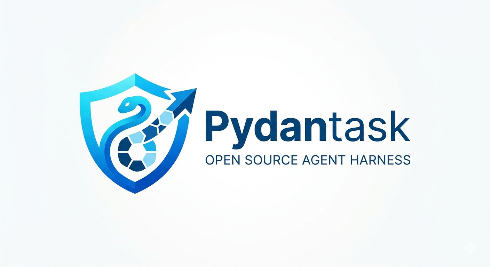

# PydanTask: Deep Agentic Harness for Pydantic AI



PydanTask is an **alpha** harness for building deep, multi-step agents on top of [Pydantic AI](https://ai.pydantic.dev/).

If you want agents that can **plan**, **execute**, **self-critique**, and **ship a final artifact** (not just chat), this gives you the backbone.

What you get:

- **Dynamic task DAGs**: a supervisor creates/patches a task graph at runtime
- **Parallel execution**: run dependency-satisfied tasks concurrently
- **Critic QA + retries**: failed tasks become `RERUN` until `max_attempts`, then `FAILED`
- **Observability**: optional tracing (Langfuse, Logfire, LangSmith)
- **Recovery/auditability**: optional event-sourced checkpointing (`events.jsonl` + summaries + large-result sidecars)
- **Extensibility**: register your own capabilities via `CapabilityDescription`

### Try it in ~3 minutes

1) Install:

```bash
pip install pydantask
```

2) Set env vars:

```bash
export OPENAI_API_KEY="..."
# Optional: enables Tavily web search; otherwise DuckDuckGo-based search is used
export TAVILY_API_KEY="..."
```

3) Run a minimal agent:

```python
import asyncio
from pydantask.agents import DeepAgent


async def main() -> None:
    agent = DeepAgent(
        objective="Compare 3 open-source LLMs for local inference and recommend one.",
        model="openai:gpt-4.1-mini",  # or "anthropic:..." or pass a Model instance
        trace=False,
        checkpoint=False,
        max_steps=10,
    )

    result = await agent.run()
    print(result.final_result.detailed_output if result.final_result else result.errors)


if __name__ == "__main__":
    asyncio.run(main())
```

> Alpha note: the core loop is working and tested, but the API and prompts are still evolving. If you hit rough edges, please open an issue with a minimal repro.

For deeper docs and API reference, see: **[pydantask.readthedocs.io](https://pydantask.readthedocs.io/en/latest/)**

---

## High-Level Architecture

The core orchestrator is `DeepAgent`:

```python
from pydantask.agents.agent import DeepAgent
```

`DeepAgent` coordinates several built‑in agents:

- **Supervisor** – plans and chooses which tasks to run next, based on statuses and dependencies.
- **Researcher** – performs web/external research for tasks that need new information.
- **Producer** – synthesizes intermediate results into a final answer or artifact.
- **Critic** – evaluates task outputs and drives deterministic retry/fail transitions.

They all operate over a shared `RuntimeState`:

```python
from pydantask.models import RuntimeState, TaskItem, TaskResult, Plan
```

Key concepts:

- **Plan** (`Plan`):
  - `reasoning_steps`: planner’s internal notes
  - `tasks`: list of `TaskItem` instances
- **TaskItem**: one sub‑task in the plan, with:
  - `task_id`, `overall_objective`, `sub_task_objective`
  - `capability` (which sub‑agent to use, e.g. `"research_agent"`)
  - `sub_task_dependencies` (other task IDs that must complete first)
  - `status` (`TaskStatus`: `PENDING`, `READY`, `RUNNING`, `NEEDS_REVIEW`, `COMPLETED`, `FAILED`, `ERRORED`, `RERUN`)
  - `result` (`TaskResult`) and `task_feedback` (`TaskQAResult`)
- **RuntimeState**:
  - `plan: Dict[int, TaskItem]`
  - `objective: str`
  - `capability_registry: Dict[str, CapabilityDescription]` *(excluded from serialization)*
  - `document_store`, `knowledge_store`, `runtime_steps`, etc.

The control loop in `DeepAgent.run()`:

1. Supervisor incrementally builds a task DAG for the objective (via tools like `add_task`).
2. `RuntimeState` is initialized with the capability registry.
3. In each cycle:
   - Supervisor decides which tasks to execute next based on plan progress, task dependencies, and self reflection.
   - Ready tasks, so long as dependencies are satisfied, are executed by the appropriate capability (sub‑agent).
   - Critic reviews each result and produces a "QA" report for the supervisor to review if the task failed.
4. Loop stops when:
   - the Supervisor sets `all_tasks_completed = True` **and** the run’s completion invariants are met (exactly one task is marked `is_final=True`, and that task is `COMPLETED` with a `TaskResult`), or
   - `max_steps` is reached, or
   - the harness stops after several no-progress cycles (safety guardrail).

For more detail, see `docs/agents.md`.

---

## Installation & Setup

PydanTask assumes you already have Pydantic AI and an OpenAI‑compatible model configured. A Tavily API key is **optional** for the built‑in research agent (it falls back to DuckDuckGo search if omitted).

### 1. Install dependencies

From your project root:

```bash
pip install pydantask
```

(or however you manage your environment; if you use Poetry, adjust accordingly.)

### 2. Environment variables

Set the following environment variables (e.g. in your shell or a `.env` file):

- `OPENAI_API_KEY` – for the underlying OpenAIChatModel (or whatever your Pydantic AI provider expects).
- `TAVILY_API_KEY` – *(optional)* used by the `research_agent` (via `tavily_search_tool`). If this key is not set, it defaults to DuckDuckGo search.

---

## Quickstart: Running a DeepAgent

Minimal example that creates a `DeepAgent` and runs it on a single objective:

```python
import asyncio

from pydantask.agents.agent import DeepAgent

async def main() -> None:
    agent = DeepAgent(
        objective="Write an overview of ghost lights folklore and summarize scientific explanations.",
        model="gpt-4.1-mini",  # or any compatible OpenAIChatModel name
        max_steps=10,
    )

    run_result = await agent.run()
    runtime_state = run_result.runtime_state

    # Inspect the final plan and results
    for task_id, task in sorted(runtime_state.plan.items()):
        print(f"Task {task_id} [{task.status}]: {task.sub_task_objective}")
        if task.result is not None:
            print("  Summary:", task.result.summary)
            # The main long-form output for the task is stored in-memory:
            print("  Detailed output:", (task.result.detailed_output or "<empty>"))
            print()

if __name__ == "__main__":
    asyncio.run(main())
```

What this does:

1. Constructs a `DeepAgent` with default Supervisor, Researcher, Producer, and Critic.
2. Supervisor (dynamic DAG architect) breaks down the objective into `TaskItem`s using built-in capabilities.
3. Supervisor picks tasks to run in each loop iteration.
4. Researcher and Producer execute those tasks and return structured `TaskResult`s.
5. Critic evaluates each task result and marks tasks as:
   - `COMPLETED` when QA passes
   - `RERUN` when QA fails but retries remain (critic feedback is appended to the task objective)
   - `FAILED` when QA fails and `max_attempts` is exceeded
6. When done, you get a `RuntimeState` with the full plan and results.

> Note: by default, this harness treats task artifacts as **in-memory** outputs (e.g. `TaskResult.detailed_output`).
>
> However, it *does* support optional **event-sourced checkpointing** (`checkpoint=True`) which persists an append-only `events.jsonl` log (plus summaries and, when needed, sidecar JSON files for large results) under `_checkpoint/`.
>
> Filesystem tools exist in `pydantask.tools.default_tools`, but they are **not enabled by default** in the built-in agents.

---

## Customizing Capabilities

You can add custom sub‑agents or tools via `CapabilityDescription` and the `sub_agents` argument.

### Example: custom agent capability

```python
from pydantic_ai import Agent
from pydantask.agents.agent import DeepAgent
from pydantask.models import CapabilityDescription, TaskResult, TaskRunDeps

my_special_agent = Agent(
    model=...,  # e.g. the same OpenAIChatModel
    name="_my_special_agent",
    system_prompt="You are a specialized agent for security analysis.",
    deps_type=TaskRunDeps,   # gives tools access to deps.runtime_state + deps.task
    output_type=TaskResult,
    tools=[...],  # tools should typically accept RunContext[TaskRunDeps]
)

custom_capability = CapabilityDescription(
    name="security_agent",  # used in TaskItem.capability
    description="Performs security-focused analysis and risk assessment.",
    tool_func=my_special_agent,
)

agent = DeepAgent(
    objective="Assess the security posture of this web application.",
    sub_agents=[custom_capability],
)

# Now the Planner can choose `security_agent` as a capability in the plan.
```

### Example: simple function capability (runnable capability)

`DeepAgent` expects a *capability* to be runnable (i.e. something with a `.run(prompt, deps, usage_limits=...)` method). For plain functions, wrap them with `as_runner(...)`.

```python
from pydantask.agents.agent import DeepAgent
from pydantask.capabilities.runner import as_runner
from pydantask.models import CapabilityDescription, TaskResult, TaskRunDeps


async def my_utility_capability(prompt: str, deps: TaskRunDeps) -> TaskResult:
    # prompt is the task prompt; deps.runtime_state + deps.task give you context
    return TaskResult(task_id=deps.task.task_id, summary="processed", detailed_output=prompt)


utility_capability = CapabilityDescription(
    name="my_utility_tool",
    description="Utility capability that processes a prompt and returns a TaskResult.",
    tool_func=as_runner(my_utility_capability),
)

agent = DeepAgent(objective="Some goal...", sub_agents=[utility_capability])
```

For more customization details, see:

- `docs/customization.md`
- `docs/tools.md`
- `docs/agents.md`

---

## Running Unit Tests

Tests live under the `test/` directory and are written to be compatible with both `pytest` and the standard library `unittest`.

### Recommended: pytest

From the repository root:

```bash
pip install pytest
pytest
```

### Using unittest directly

If you prefer `unittest`, you can still run the suite with:

```bash
python -m unittest discover -s test -p "test_*.py"
```

Make sure required environment variables (e.g. `TAVILY_API_KEY`, `OPENAI_API_KEY`) are set, or that tests patch them appropriately (as in `test/test_agent.py`).

---

