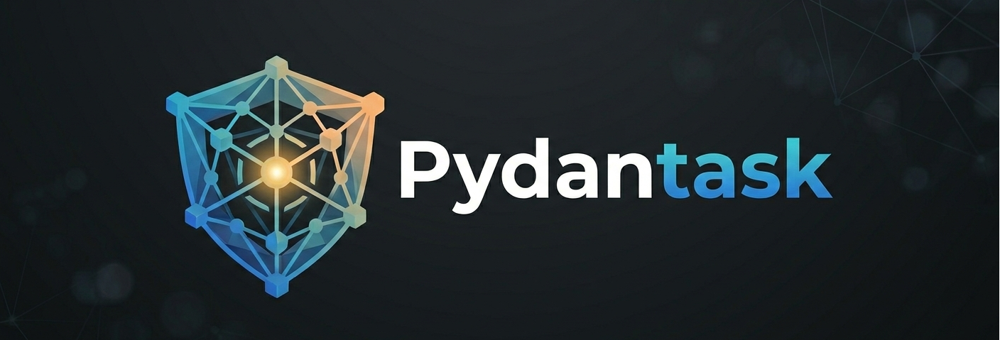

# Pydantask Deep Agent Harness

Welcome to the **Pydantask Deep Agent Harness**. This library enables you to build modular, multi-agent workflows capable of complex reasoning, orchestration, and persistent context.

Features:

- Modular agent and tool architecture
- Support for persistent runtime state
- Extensible tool/agent registration
- Built-in planning, research, synthesis, and more

Start with the [Quickstart](quickstart.md).
