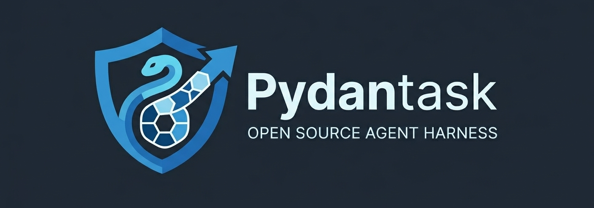

# Pydantask Deep Agent Harness

<!--  -->

 

Welcome to the **Pydantask Deep Agent Harness**. This library enables you to build modular, multi-agent workflows capable of complex reasoning, orchestration, and persistent context.

> Alpha note: this project is actively evolving. Expect sharp edges and occasional API changes; please open issues/PRs as you try it out.

Features (alpha):

- Modular agent + tool architecture built on Pydantic AI
- Dynamic task-DAG orchestration (supervisor → workers/research → critic)
- QA-driven retries (`RERUN` until `max_attempts`, then `FAILED`)
- Deterministic scheduler pass (dependency gating + readiness normalization)
- Optional **event-sourced checkpointing** for replay/resume (`checkpoint=True`)
- Optional tracing (Langfuse, Logfire, LangSmith)
- Extensible capability registry (`CapabilityDescription`) for custom sub-agents

Start with the [Quickstart](quickstart.md) guide to see how easy it is to add a Deep Agent to your workflow!
